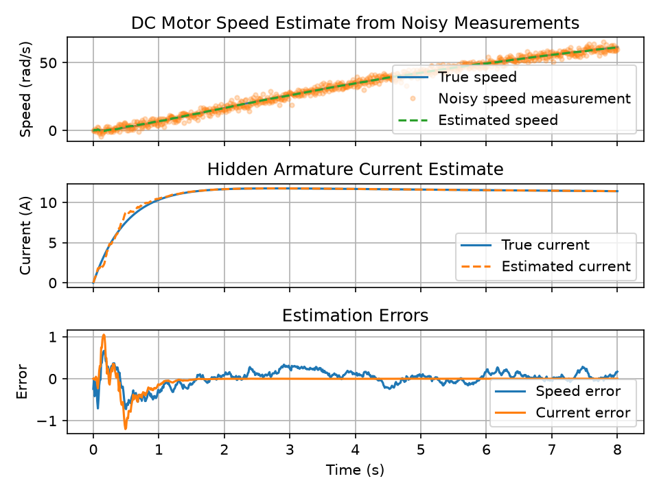
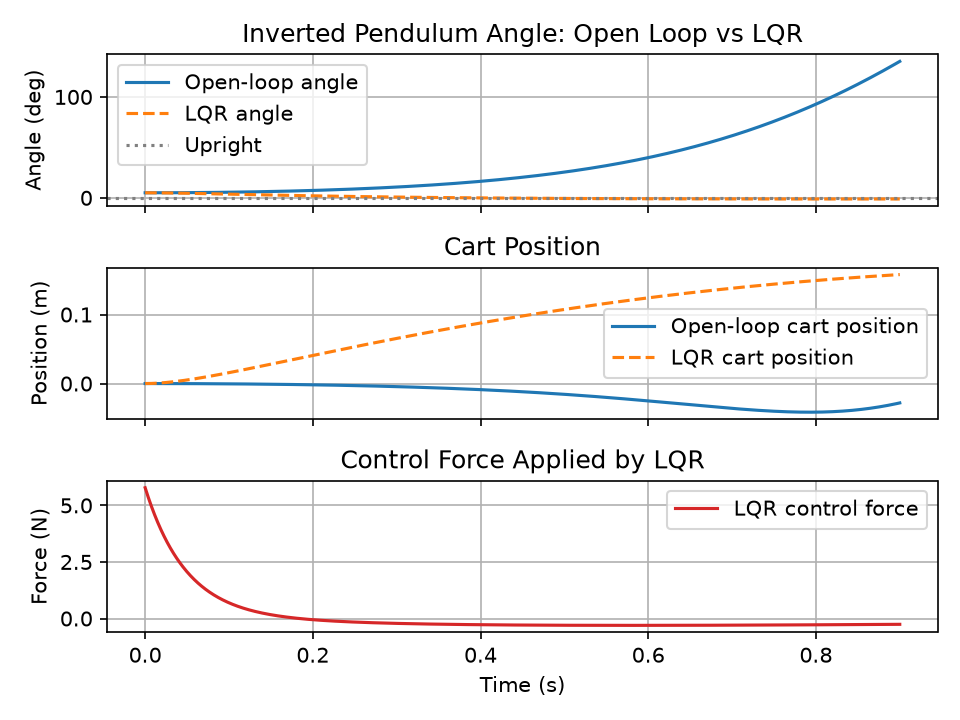
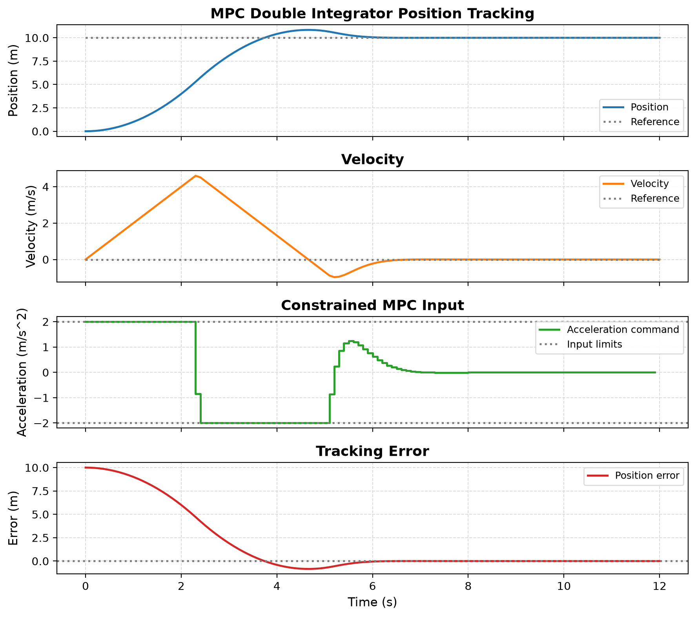
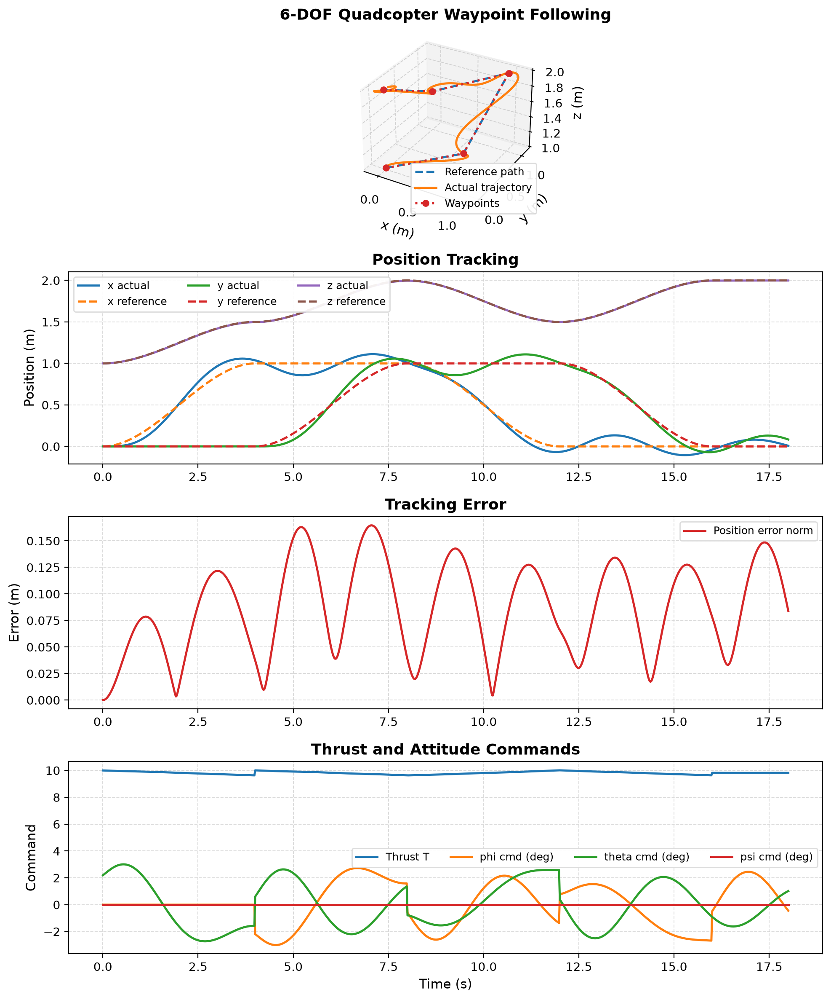
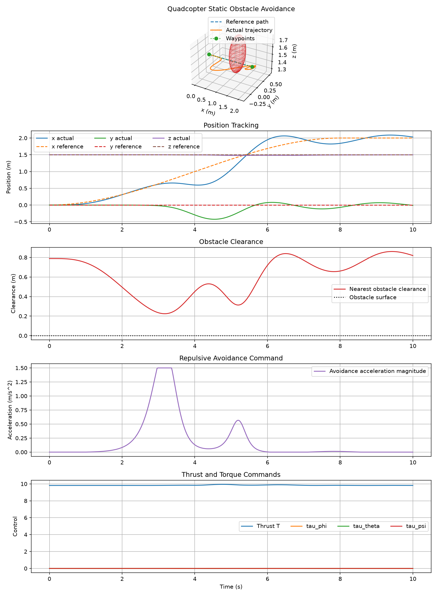
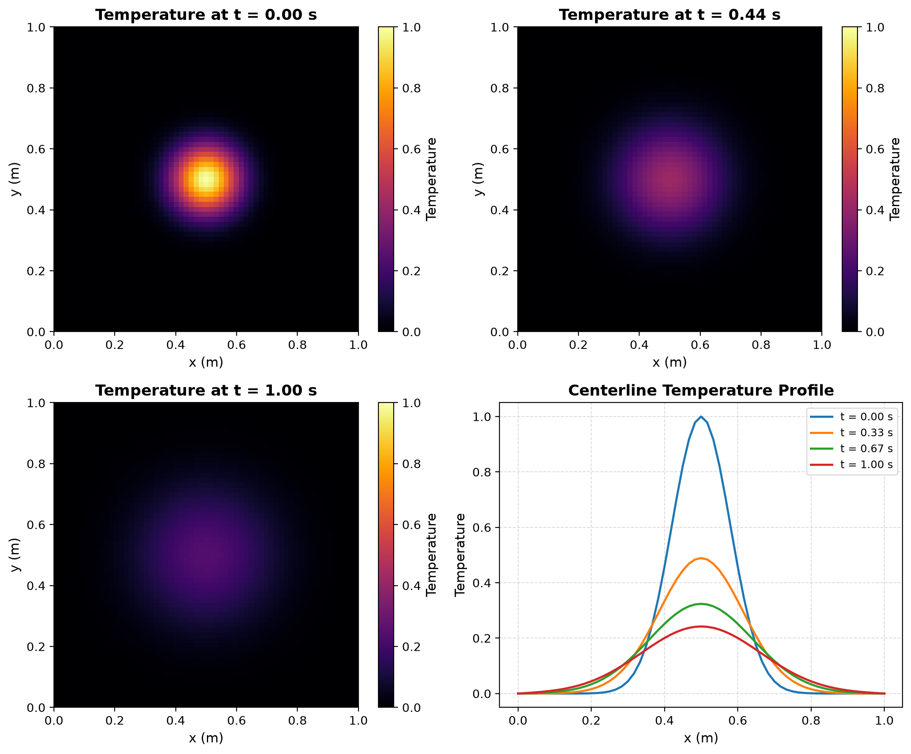
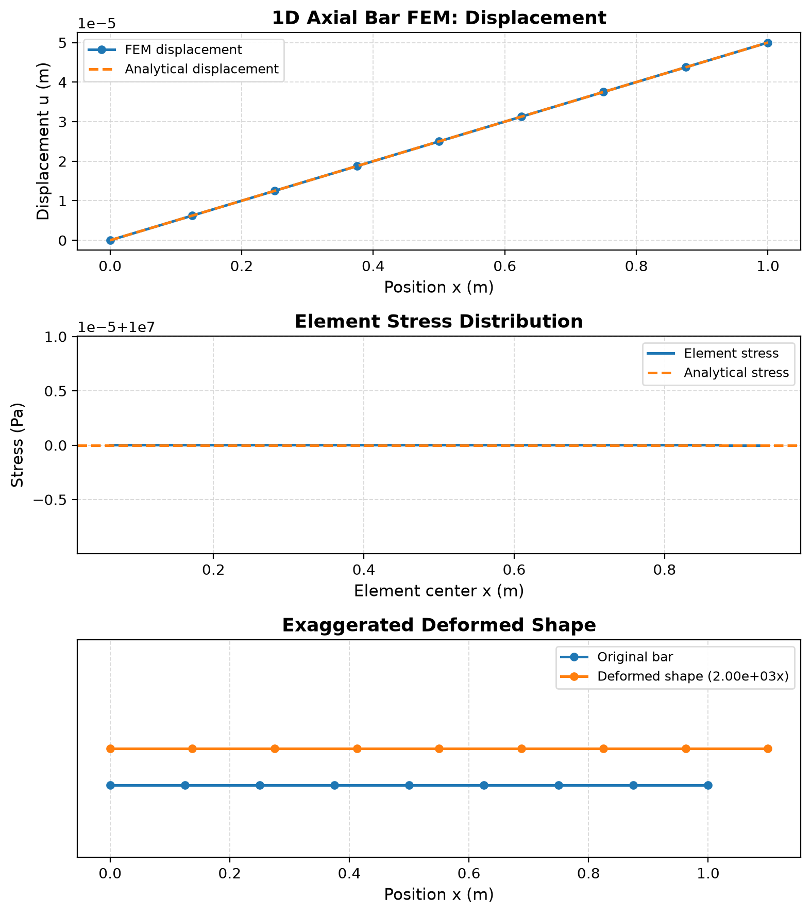

# Engineering Simulation Toolkit

A Python engineering simulation toolkit for control systems, numerical methods, PDEs, FEM basics, UAV dynamics, and scientific visualization.

## Overview

Engineering Simulation Toolkit is a portfolio-oriented engineering simulation project. It started as an ODE simulator and has grown into a broader toolkit for representative electrical, mechanical, thermal, control, UAV, state-estimation, PDE, FEM, and numerical-methods problems with clear Python modules, runnable examples, plots, tests, and documentation.

The project is intentionally educational: it emphasizes readable equations, reproducible examples, and engineering intuition. It is not production-grade industrial simulation, certified control software, or a replacement for specialized tools such as Simulink, ANSYS, COMSOL, or flight-control stacks.

## Feature Highlights

### Circuits

- RC charging response with numerical and analytical comparison.
- RL current step response with time-constant behavior.
- Series RLC transient response with damping ratio, natural frequency, overshoot, and settling behavior.
- RLC resistance, capacitance, and inductance sweep examples.

### Mechanical Systems

- Newton cooling as a first-order thermal model.
- Mass-spring-damper free vibration.
- Nonlinear pendulum dynamics with small-angle comparison.
- Inverted pendulum / cart-pole open-loop instability and linearized upright model.

### Control Systems

- First-order and second-order control-system step responses.
- Reusable step-response metrics for rise time, settling time, overshoot, peak value, and peak time.
- DC motor electromechanical dynamics.
- PI and discrete PID motor speed control with saturation, anti-windup, and disturbance-response examples.
- LQR stabilization for the nonlinear inverted pendulum near the upright equilibrium.
- Frequency-response, transfer-function, and state-space utilities.

### State Estimation

- Discrete Kalman filter examples for DC motor and RLC systems.
- Extended Kalman Filter for nonlinear pendulum state estimation.
- Unscented Kalman Filter for nonlinear pendulum state estimation without hand-derived Jacobians.
- Bootstrap Particle Filter for nonlinear pendulum state estimation with weighted particles and resampling.

### Optimization / MPC

- Linear Model Predictive Control for a constrained double-integrator tracking problem.
- Receding-horizon simulation with input limits and quadratic tracking/control-effort cost.

### UAV / Quadcopter

- 1D quadcopter altitude dynamics and PID altitude control.
- Simplified roll, pitch, and yaw attitude dynamics with PID attitude control.
- Full 6-DOF quadcopter rigid-body dynamics.
- Cascaded trajectory tracking for hover and circular references.
- Waypoint following with smooth reference generation.
- Static spherical obstacle avoidance using a local repulsive potential-field term.
- Matplotlib 3D animation helpers for 6-DOF quadcopter trajectories.

### PDEs

- 1D heat equation with explicit finite differences.
- 2D heat equation on a rectangular grid.
- 1D wave equation with CFL stability checks.
- 2D wave equation for membrane-style propagation and reflection.

### Numerical Methods

- Forward, backward, and central finite-difference derivative utilities.
- Second-derivative finite-difference approximation.
- Error metrics and convergence-order estimation.
- Explicit stability checks for heat and wave equation examples.

### FEM Basics

- Educational 1D axial bar finite element solver.
- Uniform mesh generation, linear element stiffness, global assembly, displacement boundary conditions, reactions, strains, and stresses.
- Comparison against the analytical fixed-free axial bar solution.

### Visualization / Streamlit

- Matplotlib plots for examples and selected saved screenshots.
- Matplotlib animation helpers for inverted pendulum and quadcopter trajectories.
- Streamlit browser UI for selected simulations across circuits, control, PDEs, numerical methods, and FEM.

## Gallery

All images below are existing repository assets generated by project examples.

| Circuits / Control | Estimation |
|---|---|
|  |  |
| **RLC circuit step response** | **Kalman filter state estimation** |

| Inverted Pendulum / LQR | Optimization / MPC |
|---|---|
|  |  |
| **Open-loop instability vs LQR stabilization** | **Constrained MPC tracking** |

| UAV / Quadcopter | UAV Obstacle Avoidance |
|---|---|
|  |  |
| **6-DOF waypoint following** | **Static obstacle avoidance** |

| PDEs | FEM |
|---|---|
|  |  |
| **2D heat diffusion** | **1D axial bar finite element method** |

## Quick Start

Create a virtual environment and install dependencies:

```powershell
python -m venv .venv
.\.venv\Scripts\Activate.ps1
python -m pip install -r requirements.txt
```

For an editable development install:

```powershell
python -m pip install -e ".[dev]"
```

Run the tests:

```powershell
python -m pytest
```

Run an example:

```powershell
python examples/run_rlc_circuit.py
```

## Running Selected Examples

These examples cover the main project domains without listing every script:

```powershell
# Circuits and controls
python examples/run_rc_circuit.py
python examples/run_rlc_circuit.py
python examples/run_second_order_control.py
python examples/run_discrete_pid_motor.py

# State estimation and optimal control
python examples/run_kalman_dc_motor.py
python examples/run_ekf_pendulum.py
python examples/run_mpc_double_integrator.py

# Inverted pendulum
python examples/run_inverted_pendulum_open_loop.py
python examples/run_inverted_pendulum_lqr_comparison.py

# Quadcopter / UAV
python examples/run_quadcopter_6dof_hover.py
python examples/run_quadcopter_trajectory_circle_tracking.py
python examples/run_quadcopter_waypoint_following.py
python examples/run_quadcopter_obstacle_avoidance.py

# PDEs and numerical methods
python examples/run_heat_equation_1d.py
python examples/run_heat_equation_2d.py
python examples/run_wave_equation_1d.py
python examples/run_wave_equation_2d.py
python examples/run_finite_difference_convergence.py
python examples/run_fem_1d_bar.py
```

Some examples display plots interactively. Selected scripts also save PNG outputs under `examples/` or `docs/screenshots/`.

## Streamlit App

Run the browser UI with:

```powershell
streamlit run streamlit_app.py
```

The app currently includes selected demos for:

- Home and About overview pages.
- Control-system demos for RC/RLC circuits and DC motor PID control.
- PDE solver demos for 1D/2D heat equations and 1D/2D wave equations.
- Numerical-methods demo for finite-difference convergence.
- FEM basics demo for a 1D axial bar.
- Portfolio overview pages for state-estimation and UAV/quadcopter examples.

## Testing

Run the full test suite:

```powershell
python -m pytest
```

For verbose local test output:

```powershell
python -m pytest -v
```

On Windows PowerShell, use a fresh temporary pytest directory and disable
pytest's cache provider if file-locking or cleanup permissions get in the way:

```powershell
$stamp = [DateTimeOffset]::UtcNow.ToUnixTimeSeconds()
python -m pytest -v --basetemp=".pytest_tmp_$stamp" -p no:cacheprovider
```

From Git Bash, the equivalent command is:

```bash
python -m pytest -v --basetemp=".pytest_tmp_$(date +%s)" -p no:cacheprovider
```

Run the Streamlit app:

```powershell
streamlit run streamlit_app.py
```

Install the project in editable mode with development tools:

```powershell
python -m pip install -e ".[dev]"
```

The tests cover implemented models and analysis helpers, including physical behavior, known formulas, stability checks, control metrics, state-estimation utilities, PDE solvers, FEM basics, and selected visualization helpers.

## Project Architecture

```text
models/          Physical systems, ODE/PDE models, and simulation functions
analysis/        Reusable analysis tools, controllers, estimators, MPC, FEM, export helpers
visualization/   Matplotlib animation helpers for pendulum and quadcopter demos
examples/        Runnable scripts that print parameters and generate plots
tests/           pytest coverage for numerical and engineering behavior
docs/            Equations, architecture notes, screenshots, and future ideas
streamlit_app.py Interactive browser UI for selected simulations
```

The codebase follows a simple pattern: keep equations and simulation logic in model or analysis modules, keep plotting and demonstration workflows in examples, and verify behavior with focused tests.

## Theory Documentation

Concise background notes are available for the main engineering and numerical
methods areas:

- [Theory overview](docs/theory_overview.md)
- [Control systems](docs/control_systems.md)
- [State estimation](docs/state_estimation.md)
- [PDE methods](docs/pde_methods.md)
- [FEM basics](docs/fem_basics.md)
- [UAV models](docs/uav_models.md)
- [Numerical methods](docs/numerical_methods.md)

## Skills Demonstrated

- Scientific Python with NumPy, SciPy, Matplotlib, Streamlit, and pytest.
- Differential equation modeling with `scipy.integrate.solve_ivp`.
- Control-system analysis: step response, PID, LQR, transfer functions, state space, and frequency response.
- State estimation with Kalman, Extended Kalman, Unscented Kalman, and Particle Filters.
- Constrained optimal control with linear MPC.
- UAV rigid-body modeling and simplified trajectory control.
- PDE simulation with explicit finite-difference methods.
- Numerical differentiation and convergence analysis.
- Introductory finite element assembly and post-processing.
- Modular project structure, validation, tests, and documentation.

## Roadmap

Completed project areas include circuits, mechanical systems, control systems, state estimation, MPC, inverted pendulum, quadcopter dynamics and tracking, heat and wave equations, finite differences, FEM basics, Streamlit UI, tests, and documentation.

Potential next improvements:

- 2D truss FEM solver.
- Beam bending FEM.
- Streamlit polish for PDE and portfolio demos.
- Packaging and release polish.
- More curated screenshots or short demo animations for portfolio sharing.

See [ROADMAP.md](ROADMAP.md) for the current tracked roadmap.

## Limitations / Educational Scope

- Models are simplified and intended for learning, portfolio demonstration, and technical discussion.
- Controllers are educational examples, not certified industrial or safety-critical control systems.
- Quadcopter examples do not include rotor-level motor dynamics, real autopilot firmware, sensor fusion stacks, SLAM, or global path planning.
- Obstacle avoidance is local and reactive around static spherical obstacles.
- PDE solvers use explicit finite-difference methods with stability constraints, not high-performance production solvers.
- FEM coverage is introductory and currently limited to a 1D axial bar example.
