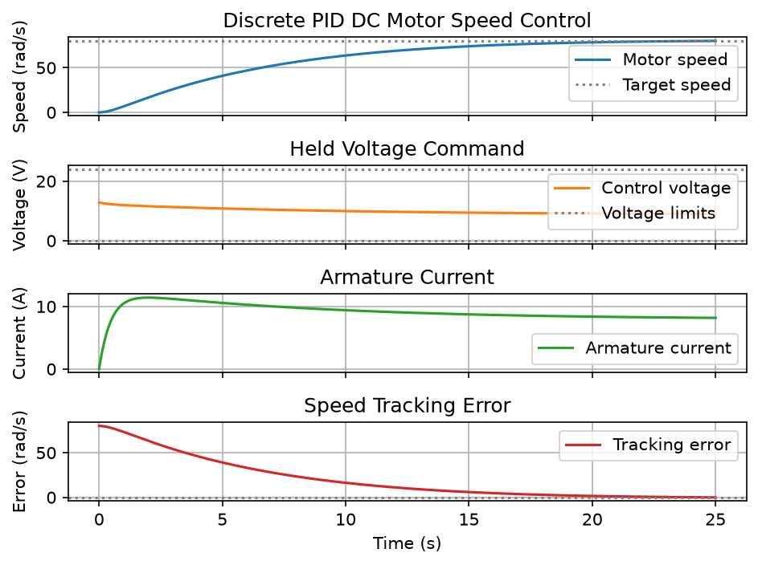
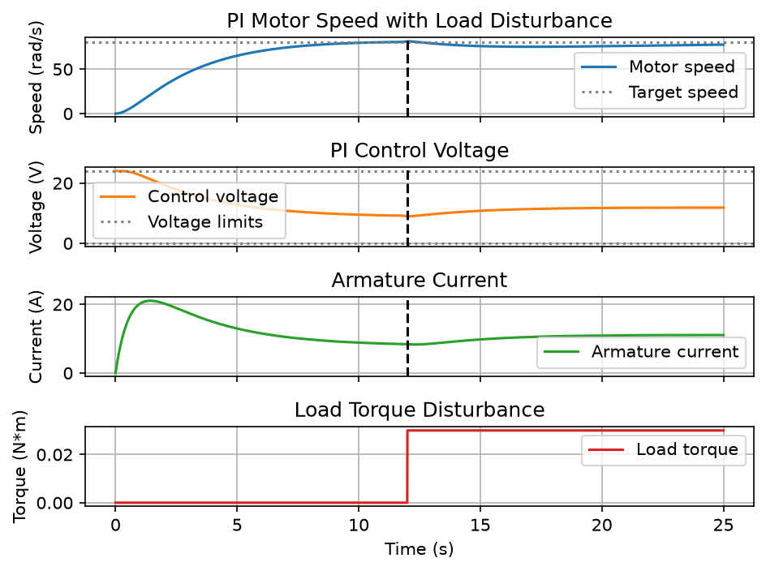
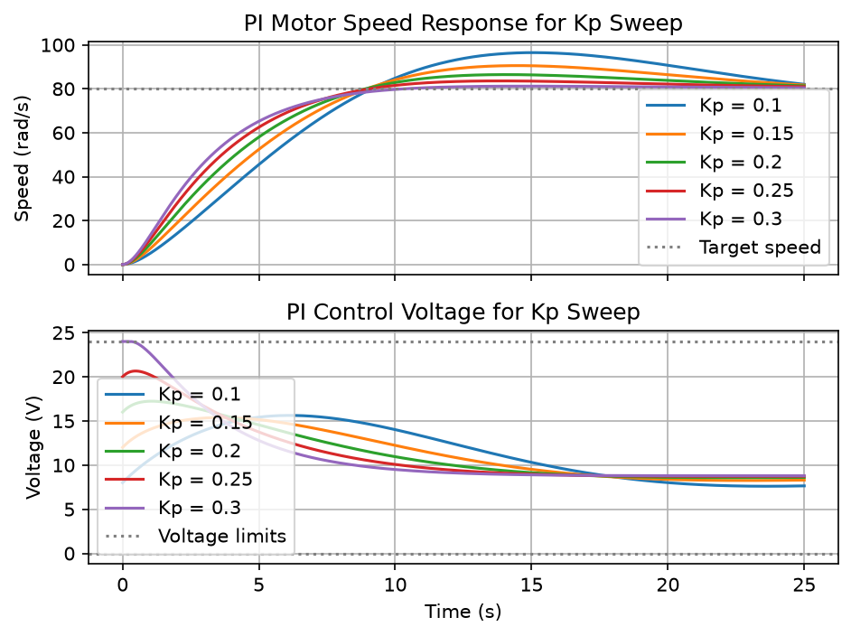
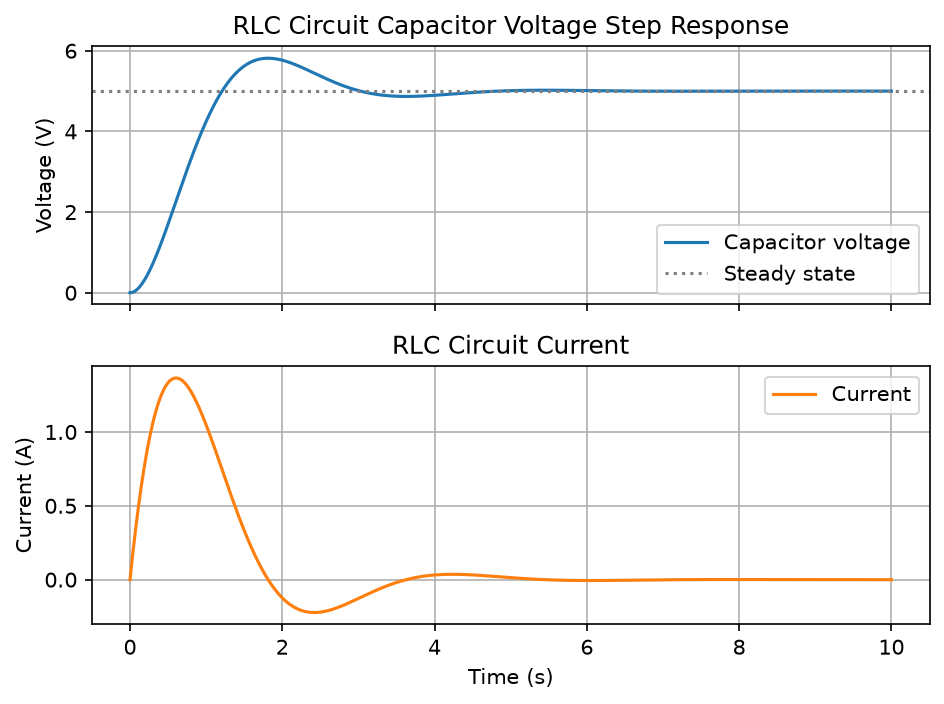

# Engineering ODE Simulator

Engineering ODE Simulator is a portfolio project for modeling simple
engineering systems with ordinary differential equations (ODEs). The goal is
to pair numerical simulations with analytical solutions where possible, so the
results are easy to understand and verify.

The project currently includes:

- RC circuit charging
- Newton's Law of Cooling
- Mass-spring-damper free vibration
- First-order control system step response
- Second-order control system step response
- Reusable step response metrics
- RL circuit step response
- Series RLC circuit step response
- Simple pendulum nonlinear dynamics
- DC motor speed response
- DC motor PI speed control
- PI motor gain sweep analysis
- DC motor PI load disturbance response
- Discrete PID motor speed control
- Interactive Streamlit GUI for selected simulations
- Frequency response and Bode plot examples
- CSV export for selected simulation results
- Saved screenshots for selected plots

## Example Results

### Discrete PID Motor Control



A discrete PID controller regulates DC motor speed with low steady-state error
and controlled actuator voltage.

### Load Disturbance Response



The PI motor controller recovers speed after a load torque disturbance.

### PI Gain Sweep



The gain sweep compares how different proportional gains affect motor speed
tracking and control effort.

### RLC Circuit Step Response



The RLC example shows underdamped second-order electrical dynamics with
overshoot and settling behavior.

## RC Circuit Charging

An RC circuit has a resistor and capacitor connected to an input voltage. When
the input voltage is applied, the capacitor voltage rises over time toward the
input voltage.

The differential equation is:

```text
dVc/dt = (Vin - Vc) / (R*C)
```

Where:

- `R` is the resistance in ohms.
- `C` is the capacitance in farads.
- `Vin` is the input voltage in volts.
- `Vc` is the capacitor voltage in volts.
- `t` is time in seconds.

The time constant is:

```text
tau = R*C
```

The time constant `tau` describes how quickly the capacitor charges. After one
time constant, a capacitor starting from 0 volts reaches about 63.2% of the
input voltage.

## Newton's Law of Cooling

Newton's Law of Cooling models how an object changes temperature as it moves
toward the temperature of its environment. A hot object cools down, and a cold
object warms up.

The differential equation is:

```text
dT/dt = -k(T - T_env)
```

The analytical solution is:

```text
T(t) = T_env + (T0 - T_env) exp(-kt)
```

Where:

- `T` is the object temperature in degrees Celsius.
- `T0` is the initial object temperature in degrees Celsius.
- `T_env` is the environment temperature in degrees Celsius.
- `k` is the cooling constant.
- `t` is time.

The time constant is:

```text
tau = 1/k
```

The time constant `tau` describes how quickly the object approaches the
environment temperature. After one time constant, the remaining temperature
difference is about `exp(-1)`, or 36.8%, of the initial difference.

## Mass-Spring-Damper Free Vibration

A mass-spring-damper system models the motion of a mass attached to a spring
and damper. It is a common mechanical engineering model for vibration,
oscillation, and energy dissipation.

The governing equation is:

```text
m*x'' + c*x' + k*x = F(t)
```

For numerical simulation, the second-order equation is converted into a
first-order system:

```text
x' = v
v' = (F(t) - c*v - k*x) / m
```

Where:

- `m` is the mass in kilograms.
- `c` is the damping coefficient in newton-seconds per meter.
- `k` is the spring stiffness in newtons per meter.
- `x` is displacement in meters.
- `v` is velocity in meters per second.
- `F(t)` is the external force in newtons as a function of time.

For free vibration, there is no external force, so `F(t) = 0`.

The undamped natural frequency is:

```text
omega_n = sqrt(k/m)
```

The damping ratio is:

```text
zeta = c / (2*sqrt(m*k))
```

These values help describe how quickly the system oscillates and how strongly
the motion decays over time.

## First-Order Control System Step Response

This model shows how a first-order control system responds to a step input.
It is useful for visualizing gain, lag, and settling behavior.

The governing equation is:

```text
tau * dy/dt + y = K*u(t)
```

For `solve_ivp`, it is written as:

```text
dy/dt = (K*u(t) - y) / tau
```

For a constant step input with amplitude `A`, the analytical response is:

```text
y(t) = K*A + (y0 - K*A) * exp(-t/tau)
```

The steady-state value is:

```text
y_ss = K*A
```

Where `tau` is the time constant, `K` is the system gain, `u(t)` is the input,
and `y` is the output. The example also prints practical response metrics:
rise time and settling time.

## Second-Order Control System Step Response

This model simulates the standard second-order control system and compares
theoretical response metrics with measured metrics from the numerical output.

The transfer function is:

```text
omega_n^2 / (s^2 + 2*zeta*omega_n*s + omega_n^2)
```

The time-domain equation is:

```text
y'' + 2*zeta*omega_n*y' + omega_n^2*y = omega_n^2*u(t)
```

The state variables are output `y` and output velocity `y'`. The damping ratio
describes the response type: underdamped, critically damped, or overdamped.
The example prints theoretical overshoot, peak time, and approximate settling
time, then uses the reusable step response metrics on the simulated output.

## Reusable Step Response Metrics

The simulator also includes reusable step response analysis utilities in
`analysis/step_response.py`. These can compute:

- rise time
- settling time
- overshoot
- peak value
- peak time

## RL Circuit Step Response

An RL circuit models the current through a resistor and inductor connected to a
DC step input voltage.

The governing equation is:

```text
L di/dt + R i = Vin
```

For `solve_ivp`, it is written as:

```text
di/dt = (Vin - R*i) / L
```

The time constant and steady-state current are:

```text
tau = L/R
i_ss = Vin/R
```

## Series RLC Circuit Step Response

A series RLC circuit models capacitor voltage and current when a resistor,
inductor, and capacitor are driven by a DC step input.

The numerical model uses:

```text
dVc/dt = i/C
di/dt = (Vin - R*i - Vc) / L
```

The natural frequency and damping ratio are:

```text
omega_n = 1/sqrt(L*C)
zeta = (R/2)*sqrt(C/L)
```

For a DC input, the steady-state behavior is:

```text
Vc -> Vin
i -> 0
```

## Simple Pendulum

The simple pendulum model introduces nonlinear dynamics and compares the full
pendulum equation with the small-angle approximation.

The nonlinear equation is:

```text
theta'' + (g/L)sin(theta) = 0
```

The small-angle approximation is:

```text
theta'' + (g/L)theta = 0
```

The state variables are angle `theta` and angular velocity `omega`. The
small-angle natural frequency and period are:

```text
omega_n = sqrt(g/L)
T = 2*pi*sqrt(L/g)
```

## DC Motor Speed Response

The DC motor model demonstrates coupled electrical-mechanical dynamics for a
permanent-magnet motor.

The electrical equation is:

```text
V = L di/dt + R i + Ke omega
```

The mechanical equation is:

```text
J domega/dt + b omega = Kt i - TL
```

The state variables are armature current `i` and angular speed `omega`. The
example reports motor speed in both radians per second and rpm.

## DC Motor PI Speed Control

This closed-loop model tracks a target motor speed using a PI controller with a
PID-compatible API. Derivative action is reserved for a future extension.

The controller is:

```text
V = Kp*error + Ki*integral_error
```

The controller voltage is saturated between configured minimum and maximum
limits. The motor plant uses the same coupled electrical-mechanical equations
as the open-loop DC motor model, and the example shows speed tracking to a
target reference.

## Install Dependencies

Create and activate a virtual environment, then install the dependencies:

```powershell
python -m venv .venv
.\.venv\Scripts\Activate.ps1
pip install -r requirements.txt
```

## Interactive Streamlit App

The project includes a simple browser UI for selected simulations:

- RC circuit charging
- RLC circuit step response
- DC motor discrete PID speed control

Install dependencies and run the app with:

```powershell
pip install -r requirements.txt
streamlit run streamlit_app.py
```

## Frequency Response and Bode Plots

The project includes reusable frequency response helpers for continuous-time
transfer functions and Bode plot examples for common engineering systems.

Run the examples with:

```powershell
python examples/run_frequency_response_first_order.py
python examples/run_frequency_response_second_order.py
python examples/run_frequency_response_rlc.py
```

## Run the RC Circuit Example

The example simulates an RC circuit with:

- `R = 1000` ohms
- `C = 0.001` farads
- `Vin = 5` volts
- `V0 = 0` volts
- time from `0` to `5` seconds

Run it with:

```powershell
python examples\run_rc_circuit.py
```

This plots the numerical solution from `scipy.integrate.solve_ivp` and the
analytical solution on the same graph.

## Run the Cooling Example

The example simulates an object cooling with:

- `T0 = 90` degrees Celsius
- `T_env = 22` degrees Celsius
- `k = 0.08` per minute
- time from `0` to `60` minutes

Run it with:

```powershell
python examples\run_cooling.py
```

This plots the numerical and analytical temperature curves on the same graph.

## Run the Mass-Spring-Damper Example

The example simulates free vibration with:

- `m = 1` kilogram
- `c = 0.4` newton-seconds per meter
- `k = 4` newtons per meter
- `x0 = 1` meter
- `v0 = 0` meters per second
- time from `0` to `20` seconds

Run it with:

```powershell
python examples\run_mass_spring_damper.py
```

This prints the natural frequency and damping ratio, then plots displacement
over time.

## Run the First-Order Control Example

The example simulates a step response with:

- `tau = 1.5` seconds
- `K = 2.0`
- input amplitude `A = 1.0`
- `y0 = 0.0`
- time from `0` to `10` seconds

Run it with:

```powershell
python examples\run_first_order_control.py
```

This prints gain, time constant, steady-state value, rise time, and settling
time, then plots the numerical and analytical step responses.

## Run the Second-Order Control Example

The example simulates an underdamped second-order step response and uses the
reusable step response metrics.

Run it with:

```powershell
python examples\run_second_order_control.py
```

## Run the RL Circuit Example

The example simulates an RL circuit with:

- `R = 10` ohms
- `L = 2` henries
- `Vin = 5` volts
- `i0 = 0` amps
- time from `0` to `1.5` seconds

Run it with:

```powershell
python examples\run_rl_circuit.py
```

This prints the time constant and steady-state current, then plots the
numerical and analytical current responses.

## Run the RLC Circuit Example

The example simulates an underdamped series RLC circuit and uses the reusable
step response metrics to estimate rise time, settling time, peak voltage, peak
time, and overshoot.

Run it with:

```powershell
python examples\run_rlc_circuit.py
```

## Run the Pendulum Example

The example compares nonlinear pendulum motion with the linear small-angle
approximation.

Run it with:

```powershell
python examples\run_pendulum.py
```

## Run the DC Motor Example

The example simulates motor current and speed after a voltage step.

Run it with:

```powershell
python examples\run_dc_motor.py
```

## Run the DC Motor PI Control Example

The example simulates closed-loop speed tracking with voltage saturation.

Run it with:

```powershell
python examples\run_pid_motor_control.py
```

## Run the PI Gain Sweep Example

The example compares PI motor speed-control responses for several `Kp` values.

Run it with:

```powershell
python examples\run_pi_gain_sweep.py
```

## Run the Motor Load Disturbance Example

The example shows PI speed control recovering after a load torque step.

Run it with:

```powershell
python examples\run_motor_load_disturbance.py
```

## Run the Discrete PID Motor Example

The example simulates embedded-style digital PID speed control for a DC motor
and exports data to `outputs/discrete_pid_motor.csv`. CSV files can be opened
in Excel, MATLAB, LibreOffice Calc, or Python.

Run it with:

```powershell
python examples\run_discrete_pid_motor.py
```

## Run Tests

Run the test suite with:

```powershell
pytest
```

Selected examples save plot screenshots to `docs/screenshots/` for portfolio
and documentation use.

The current tests cover all implemented models, including initial conditions,
long-term behavior, one-time-constant behavior, and mechanical energy behavior.
